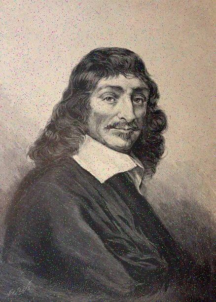
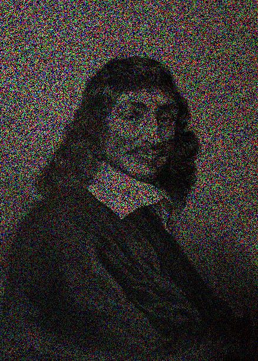

# Code Cyclique - Correcteur d'Erreur

## Description du projet

Ce projet met en œuvre un **code correcteur d'erreurs** basé sur des **codes cycliques**. Ces codes sont couramment utilisés pour détecter et corriger les erreurs pouvant survenir lors de la transmission de données. Le code utilise un polynôme générateur \( g(x) \) pour encoder les données et applique un algorithme de décodage pour tenter de restaurer les données originales, même en présence d'erreurs.  

Deux approches sont proposées :
- Une représentation des polynômes via des listes.
- Une représentation des polynômes via des entiers, utilisant leur codage binaire.

## Objectifs

- **Encodage d'images** : Ajouter une protection contre les erreurs en encodant chaque pixel de l'image avec un code cyclique.
- **Simulation d'erreurs** : Introduire des erreurs aléatoires sur l'image encodée pour simuler des erreurs de transmission.
- **Décodage et correction** : Utiliser un algorithme correcteur pour récupérer l'image d'origine, corrigée autant que possible.

## Fonctionnalités principales

- **Encodage** : Chaque pixel de l'image est transformé en un code protégé par un polynôme générateur.
- **Ajout d'erreurs** : Des altérations sont appliquées de manière aléatoire aux pixels encodés pour reproduire des erreurs de transmission.
- **Décodage** : L'algorithme correcteur tente de détecter et de corriger ces erreurs pour retrouver les valeurs d'origine.

## Résultats

Après avoir exécuté l'un des fichiers (`Code_correcteur_bit.py` ou `Code_correcteur_liste.py`), deux versions de l'image décodée seront générées :

- **Avec correction d'erreurs** : L'image obtenue après avoir appliqué l'algorithme correcteur d'erreurs.
- **Sans correction d'erreurs** : L'image obtenue sans correction, montrant les erreurs présentes après transmission.

Voici un aperçu des résultats après décodage avec et sans correction d'erreurs :

| Image avec correction d'erreurs | Image sans correction d'erreurs |
|:-------------------------------:|:-------------------------------:|
|  |  |

## Prérequis

Avant d'exécuter ce projet, assurez-vous d'avoir les bibliothèques suivantes installées :  

- `Pillow (PIL)` : Pour le traitement des images.  
- `random` : Pour simuler des erreurs aléatoires.  
- `os` : Pour la gestion des fichiers.  

Installez Pillow avec la commande suivante :  

```bash
pip install pillow
```

## Utilisation

1. Placez l'image que vous souhaitez encoder dans le dossier `images`.  
2. Modifiez la variable `nom_image` dans le fichier `Code_correcteur_bit.py` ou `Code_correcteur_liste.py` pour qu'elle corresponde au nom de votre image  
3. Exécutez l'un des fichiers :  
   - **`Code_correcteur_bit.py`** : Utilise une représentation des polynômes via des entiers (bits), plus rapide.  
   - **`Code_correcteur_liste.py`** : Utilise une représentation des polynômes sous forme de listes, plus lente.  
4. Les résultats seront sauvegardés dans le dossier `image_resultat` :  
   - L'image obtenue par décodage par l'algorithme sera enregistrée avec le suffixe `_code` dans son nom.  
   - L'image obtenue sans le décodage par l'algorithme sera enregistrée avec le suffixe `_sans_code`.

